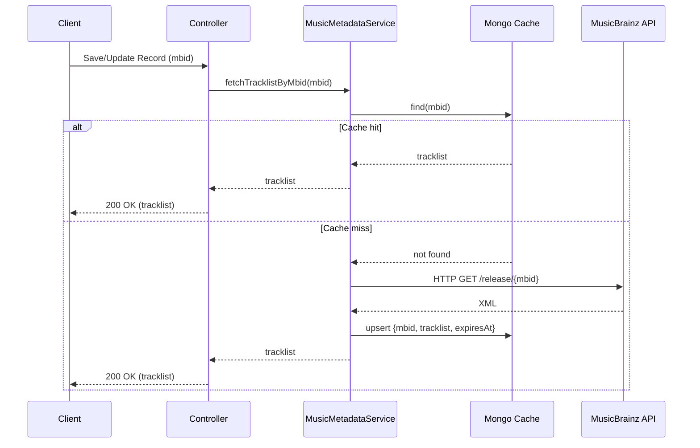

# ADR-005 — Use MongoDB MBID Cache

## Context

Tracklist metadata is fetched from MusicBrainz when an `mbid` is provided or updated. The HTTP call can add latency and may be rate limited or fail intermittently. MBIDs are globally unique and associated tracklists rarely change.

We value simplicity for now. We will use a MongoDB cache and keep the fetch synchronous within request/response flows.

## Decision

Adopt a MongoDB MBID cache with a long TTL and perform synchronous HTTP calls to MusicBrainz when the cache is cold.

- Consult the Mongo cache first for a given MBID.
- On cache miss, call MusicBrainz synchronously, upsert the result into the cache, and return the tracklist.
- No Pub/Sub, no background subscriber, and no Valkey involvement at this stage.

## Architecture

- Use cases call `MusicMetadataService.fetchTracklistByMbid(mbid)` as part of the normal flow.
- `MusicMetadataService` reads from the Mongo cache first; on miss, it performs the HTTP call, upserts the cache, and returns data to the caller.

## Sequence Diagram

## MongoDB MBID Cache

- Collection: `mbid_tracklists`
- Document shape:
  - `mbid: string` (unique)
  - `tracklist: string[]`
  - `fetchedAt: Date`
  - `expiresAt: Date` (TTL index)
- Indexes:
  - Unique on `mbid`
  - TTL index on `expiresAt`
- Behavior:
  - Cache lookup first; on miss, fetch and upsert with a new `expiresAt`.

## Implementation Sketch

- Update `MusicMetadataService` implementation:
  - Query Mongo cache first.
  - On miss, call `MusicBrainzService.fetchTracklistByMbid(mbid)`, then upsert cache and return the tracklist.
- Use cases continue calling `MusicMetadataService` synchronously; no event orchestration.

## Error Handling

- MusicBrainz HTTP errors: return an empty list and log the failure.
- Cache unavailable: proceed without cache; attempt HTTP fetch and return the result.

## TTL Strategy

- Mongo cache TTL: 30–90 days, reflecting MBID immutability and rare changes.
- Optional soft-refresh can be added later if needed.

## Consequences — Positive

- Keeps the system simple and easy to operate.
- Improves latency on cache hits and avoids repeated external calls.
- Uses persistent storage suitable for long-lived data.

## Consequences — Negative

- No decoupling from request/response; misses still incur HTTP latency.
- Less resilient to external failures compared to async processing.

## Alternatives Considered

- Valkey Pub/Sub with background workers (deferred for now).
- Caching in Valkey instead of Mongo (volatile; less suitable for long TTL).

## Rollout Plan

1. Create `mbid_tracklists` collection with unique index on `mbid` and TTL on `expiresAt`.
2. Ensure `MusicMetadataService` consults Mongo cache first, then falls back to HTTP.
3. Keep controllers/use cases synchronous; validate behavior and add logging/metrics for cache hit/miss.
